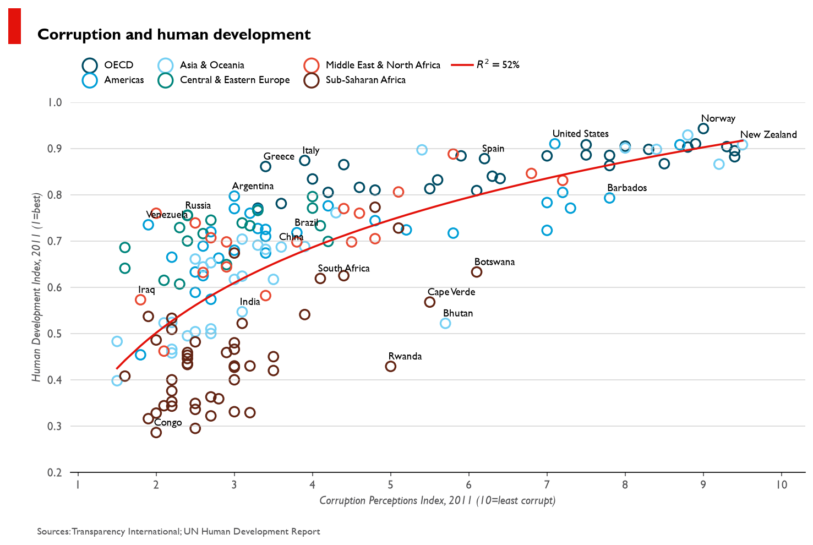
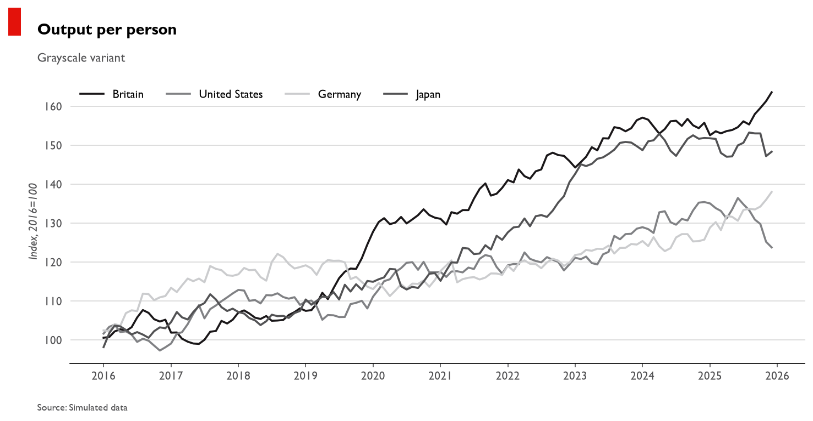
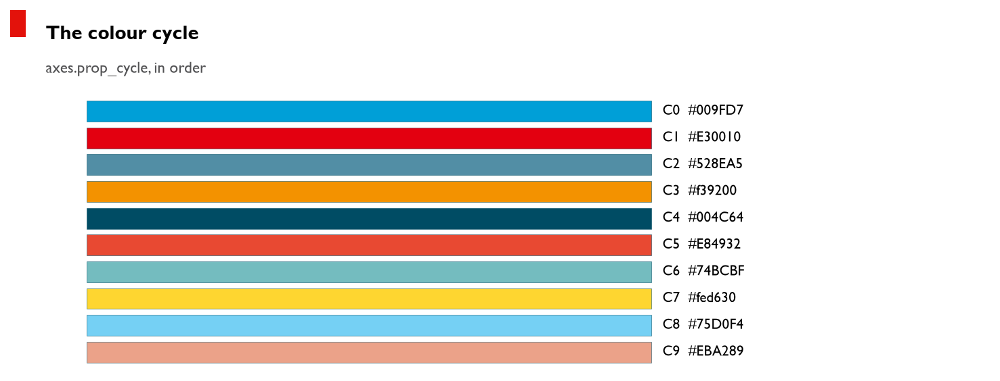
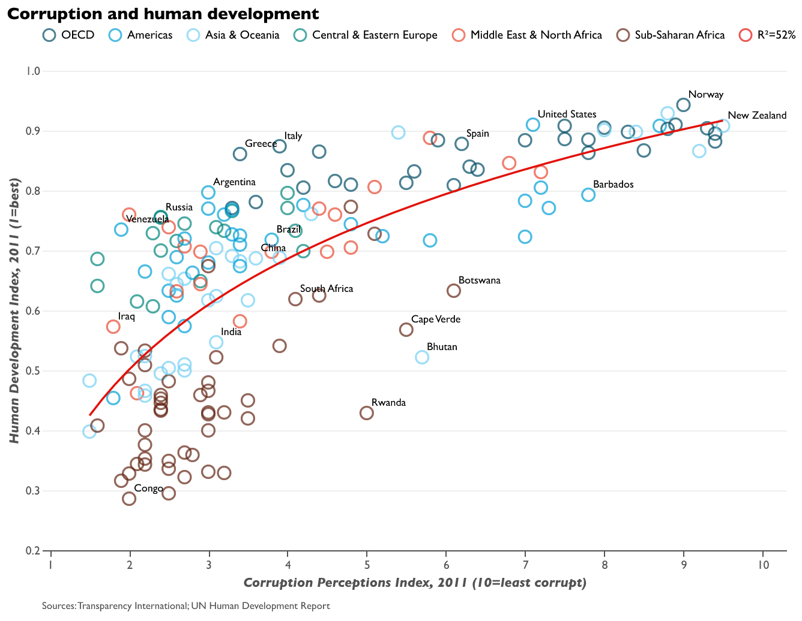
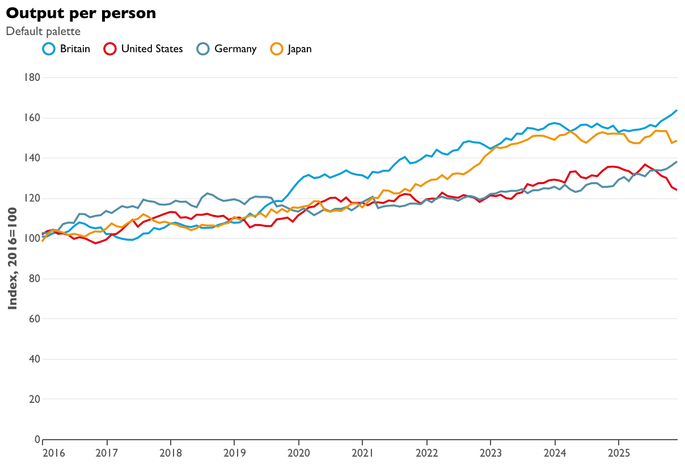

# economiststyle

An Economist-inspired Matplotlib style: a style sheet, the colour palette
behind it, the chart furniture rcParams cannot express, and the notebook that
derived the whole thing.



## Install

```bash
uv add economiststyle          # or: pip install economiststyle
```

From a checkout:

```bash
uv sync
```

## Use

Importing the package registers its style sheets and named colours with
Matplotlib, so the style resolves by bare name from any working directory:

```python
import economiststyle
import matplotlib.pyplot as plt

plt.style.use("theeconomist")        # or: economiststyle.use()
```

Add the title block — the red corner tag, bold headline and source line that a
style sheet has no vocabulary for:

```python
from economiststyle import econ_title

fig, ax = plt.subplots(figsize=(10, 6))
ax.plot(x, y)

econ_title(
    fig,
    "Corruption and human development",
    source="Sources: Transparency International; UN Human Development Report",
)
```

### The grayscale variant

For print and photocopy, layered over the base style so the two can't drift:

```python
economiststyle.use("gray")
```



### The palette

```python
economiststyle.CYCLE      # the ten cycle colours, in order
economiststyle.RAMPS      # tonal ramps by hue: RAMPS["blue"][0]
economiststyle.BRAND      # brand colours by name: BRAND["economist"]
```

Every ramp and brand colour is registered as a Matplotlib named colour, so it
works anywhere a colour string does:

```python
ax.plot(x, y, color="blue:0")
ax.axhline(0, color="economist:red")
```



### The demo dataset

The corruption-vs-development data the style was built against travels with
the package:

```python
df = economiststyle.load_cpi_hdi()
```

## The Altair theme

An optional Vega-Lite theme, kept out of the base install and out of
`economiststyle`'s own import-time registration since Altair is a separate
dependency:

```bash
uv add "economiststyle[altair]"    # or: pip install "economiststyle[altair]"
```

```python
import economiststyle.altair as economist_altair
import altair as alt

economist_altair.enable()          # or: economist_altair.enable("gray")

alt.Chart(df).mark_line().encode(x="date:T", y="value:Q", color="country:N")
```

It reproduces the colour cycle, the y-only grid, the spineless axes, and the
bold left-aligned title with a grey subtitle — everything a Vega-Lite
`config` maps onto cleanly. It does not attempt the red corner tag:
Vega-Lite has no drawing surface outside a view's own scales, so there is no
equivalent of `fig.add_artist` to place it with.





## A note on the font

The Economist sets its charts in a face that isn't freely distributable, and
the nearest common substitute — Gill Sans MT — ships with Microsoft Office
rather than with any OS. The style sheet therefore names a *stack*:

```ini
font.family     : sans-serif
font.sans-serif : Gill Sans MT, Gill Sans, Lato, Fira Sans, ..., DejaVu Sans
```

Gill Sans MT is used when present and the stack degrades gracefully when it
isn't. This matters more than it looks: setting `font.family` to a face name
directly, as earlier versions of this style did, makes Matplotlib skip the
fallback list entirely, so a machine without that font silently renders in
DejaVu Sans. For pixel-identical output everywhere, install one of the free
faces in the stack.

## Development

```bash
uv sync
uv run pytest                            # 41 tests
uv run python examples/make_gallery.py   # regenerate gallery/
```

CI runs the tests on Linux, macOS and Windows across Python 3.9–3.13, and
renders the gallery on every push. The Linux runners have no Gill Sans MT,
which is deliberate: it means the font fallback is exercised on every run
rather than only on a machine that happens to have Office installed.

## The notebook

[`MatplotlibLearning.ipynb`](MatplotlibLearning.ipynb) is the original
derivation, kept as a narrative: defining the palette, registering it with
Matplotlib, building the rcParams up piece by piece, and finally loading the
packaged sheet. It now imports from `economiststyle` rather than duplicating
its logic, and CI executes it end to end so it cannot rot.

## Licence

MIT — see [LICENSE](LICENSE).

This is an independent homage, not affiliated with or endorsed by The
Economist. The palette was eyeballed from published charts for the purpose of
learning Matplotlib; no proprietary asset is redistributed here.
